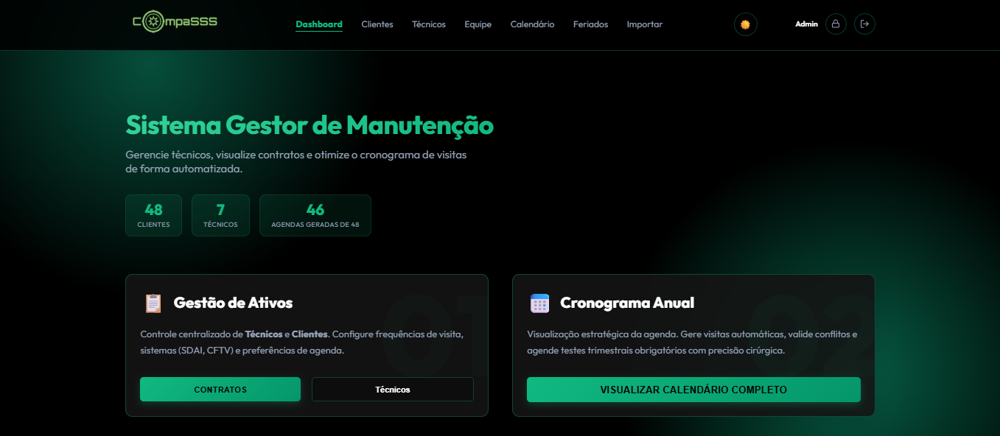
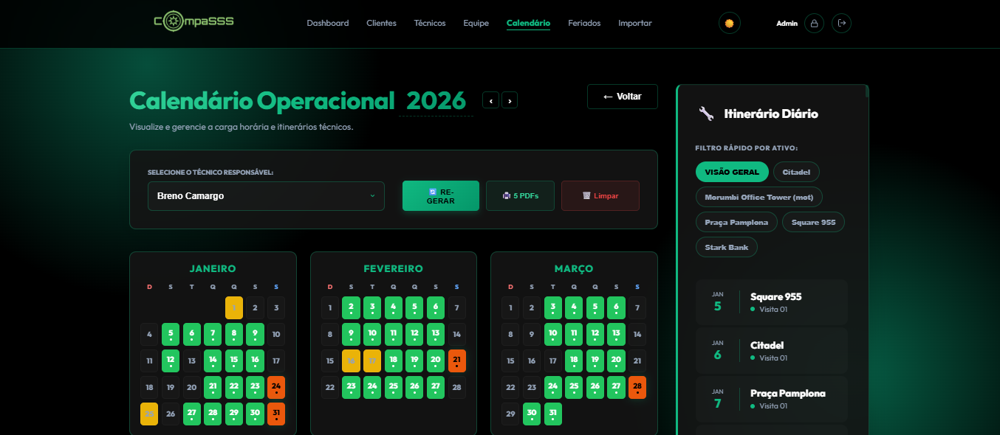
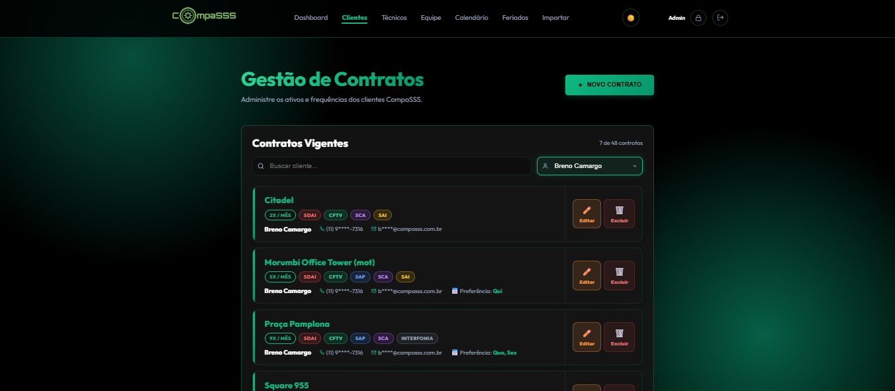
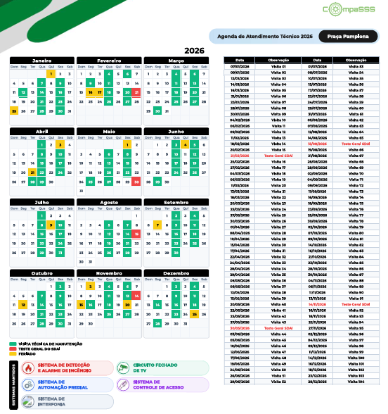
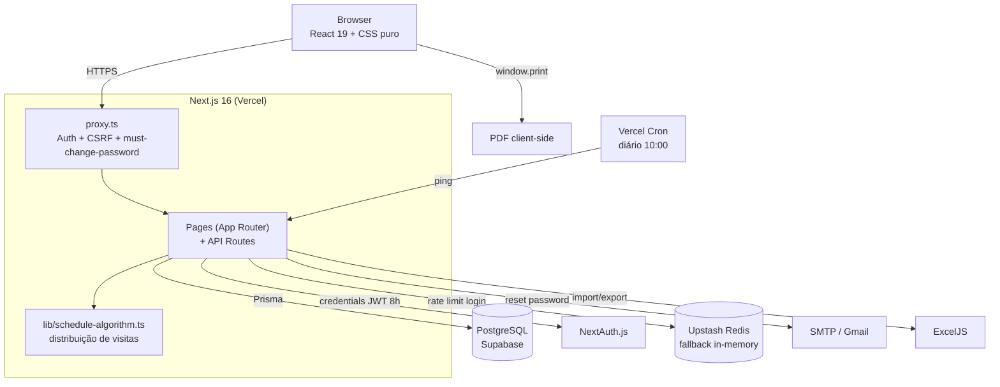

<p align="center">
  
</p>

<h1 align="center">CompaSSS — Agendador de Manutenção</h1>

<p align="center">
  Sistema interno da CompaSSS para agendar visitas técnicas e testes de sistemas (SDAI, CFTV, SCA, SAP, SAI) em prédios e shoppings.
</p>

<p align="center">
  
  
  
  
  
  
  
</p>

---

## Sumário

- [Por que existe](#por-que-existe)
- [Screenshots](#screenshots)
- [Highlights técnicos](#highlights-técnicos)
- [Arquitetura](#arquitetura)
- [O que faz](#o-que-faz)
- [Stack](#stack)
- [Rodando local](#rodando-local)
- [Testes](#testes)
- [Estrutura](#estrutura)
- [Decisões técnicas](#decisões-técnicas)
- [O que eu faria diferente](#o-que-eu-faria-diferente)
- [Roadmap](#roadmap)
- [Runbook](#runbook)
- [Licença](#licença)

## Por que existe

Antes a agenda era feita em planilha. O problema: fazer 45 agendas na mão por vezes ocasionava erros de datas. Esse sistema resolve isso automatizando a geração de cronogramas anuais e centralizando os contatos.

## Screenshots

|                Dashboard                |                Calendário                 |
| :-------------------------------------: | :---------------------------------------: |
|  |  |

|                Contratos                |                Relatório PDF                |
| :-------------------------------------: | :-----------------------------------------: |
|  |  |

## Highlights técnicos

- **Algoritmo de geração de agenda** — distribui visitas uniformemente no mês respeitando gap mínimo dinâmico, dias preferenciais por contrato, feriados móveis (Páscoa, Carnaval, Corpus Christi) e fins de semana. Geração transacional: ~400 appointments em < 1s.
- **Testes SDAI obrigatoriamente aos sábados** — exigência da norma, enforced no algoritmo com fallback pra dia útil se o sábado cair em feriado. Rotação em 3 grupos pra evitar clustering.
- **Segurança em camadas** — CSRF via origin check no proxy, rate limiting (Redis Upstash em prod, in-memory em dev), audit log de eventos sensíveis, PII masking (telefone/email) em listagens, security headers completos (CSP, HSTS, X-Frame-Options).
- **TypeScript strict sem escape hatches** — zero `any`, Zod v4 validando todo input de API, schemas centralizados em `src/lib/schemas.ts`.
- **323 testes** — unit (Vitest), API com Prisma mockado (vitest-mock-extended) e E2E (Playwright). Cobertura do algoritmo de schedule + security + rate limiting.

## Arquitetura



## O que faz

- **Calendário operacional** — gera a agenda do ano inteiro respeitando feriados, fins de semana e a frequência de cada contrato. Testes SDAI trimestrais caem no sábado automaticamente.
- **Gestão de contratos** — cada prédio tem seu contrato com frequência (mensal, bimestral, etc.), sistemas mantidos e técnico responsável.
- **Lista de contatos** — manutenção e escalonamento por contrato, com sincronização automática da equipe interna.
- **Relatório PDF** — cronograma imprimível com calendário, tabela de visitas e contatos. O pessoal do prédio precisa disso em papel.

## Stack

- **Framework** — Next.js 16 (App Router) + React 19 + TypeScript strict
- **Banco** — PostgreSQL (Supabase) + Prisma 6
- **Auth** — NextAuth.js (credentials, sessão de 8h)
- **Validação** — Zod v4
- **Email** — Nodemailer (SMTP)
- **Export/Import** — ExcelJS (planilhas), PDF gerado client-side
- **Rate limiting** — Upstash Redis (prod) / in-memory (dev)
- **Testes** — Vitest + Playwright
- **Lint/Format** — ESLint 9 (flat config) + Prettier
- **Deploy** — Vercel

## Rodando local

```bash
git clone https://github.com/breno-camargo/attendance-scheduler.git
cd attendance-scheduler
npm install
cp .env.example .env        # preencher variáveis (ver abaixo)
npx prisma generate
npx prisma db push
npm run seed:admin          # cria usuário admin inicial
npm run dev
```

Variáveis obrigatórias em `.env`:

- `DATABASE_URL` / `DIRECT_URL` — Supabase PostgreSQL (pooler + direct)
- `NEXTAUTH_SECRET` / `NEXTAUTH_URL` — auth
- `EMAIL_DOMAIN` / `NEXT_PUBLIC_EMAIL_DOMAIN` — domínio pra templates de email
- `SMTP_*` — envio de email (reset de senha)

Opcionais:

- `UPSTASH_REDIS_REST_URL` / `UPSTASH_REDIS_REST_TOKEN` — sem isso, rate limit usa memória

## Testes

```bash
npm test                    # unit + API (Vitest)
npm run test:watch          # watch mode
npm run test:coverage       # relatório de cobertura
npm run test:e2e            # E2E (Playwright, Chrome)
npm run test:all            # tudo junto
```

Testes de API mockam o Prisma — nunca hit no banco real. E2E roda contra build de dev com seed fixo.

## Estrutura

```
src/
├── app/           # páginas e API routes (App Router)
├── components/    # componentes por feature (calendar, clients, reports, ui)
├── lib/           # prisma, auth, schemas, api-utils, mail, rate-limit
├── hooks/         # custom React hooks
├── types/         # interfaces do domínio
└── proxy.ts       # auth + CSRF (Next 16 proxy)

prisma/            # schema + seeds
tests/             # unit, api, e2e
```

## Decisões técnicas

- **CSS puro em vez de Tailwind** — queria controle total do glassmorphism. Tailwind abstrairia demais os backdrop-filter e as transições que fazem o visual funcionar. Pra um projeto desse tamanho, 850 linhas de CSS é gerenciável.
- **Sem React Query/SWR** — o frontend carrega tudo de uma vez (são ~50 clientes no máximo) e filtra local. Não justifica a dependência extra. Se crescer, migro.
- **contactsJson como texto em vez de tabela** — cada contrato tem uma lista de contatos de manutenção e escalonamento que muda o tempo todo. Normalizar isso seria 3 tabelas a mais pra um dado que só aparece em 2 telas. JSON resolveu.
- **Rate limiting com Redis + fallback** — Redis (Upstash) em produção, memória em dev. Parece overkill pra 1 admin, mas a tela de login é pública e brute force é trivial. O fallback in-memory garante que funciona sem Redis configurado.
- **Sessão de 8h** — turno de trabalho. O operador loga de manhã e não precisa se preocupar até o fim do dia.
- **SDAI no sábado** — exigência da norma. O teste dispara o alarme de verdade, então o prédio precisa estar vazio.

## O que eu faria diferente

- O algoritmo de geração de agenda tem ~350 linhas e mistura concerns. Achei que precisava refactor — depois de reler, está decomposto em 5 funções puras e a complexidade real é linear nos inputs. Documentei a análise honesta no [ROADMAP](./ROADMAP.md). Aprendizado: revisar antes de assumir que código antigo precisa ser reescrito.
- Testes E2E são frágeis — dependem de dados seed e quebram se a ordem muda. Precisam de fixtures isoladas.
- Usar `legacy-peer-deps=true` no `.npmrc` é um band-aid pro conflito `next-auth@4` ↔ `nodemailer@8`. Some quando migrar pra Auth.js v5 (em beta no momento).

## Roadmap

Plano de evolução e tech debt em [ROADMAP.md](./ROADMAP.md). Sobrou pouco — só itens bloqueados em externos (Auth.js v5 GA, exceljs 5).

## Runbook

Procedimentos de emergência (admin trancado, restore de backup, rotação de secret, build travado) em [RUNBOOK.md](./RUNBOOK.md).

## Licença

Uso privado — CompaSSS.

---

<p align="center"><sub>Breno Camargo — 2026</sub></p>
